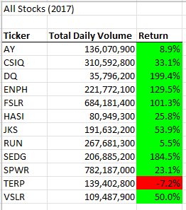
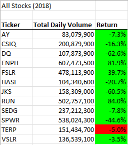

# Green Stock Analysis
## Overview of Project
Steve's parents want to invest their money into DAQO New Energy Corporation. Instead of putting all of their money into one company, Steve wants to analyze 12 green energy stock companies based on how actively the stock is traded and its yearly return. He has given me an Excel containing the stock data and I will be using Visual Basic for Applications (VBA) to build a macro to analyze all the data in a click of a button.
### Purpose
The purpose is to use VBA to build a macro that will analyze data for the entire stock market in 2017 and 2018. A macro was created with a SubRoutine, Range and For Loops to analyze all the stock data. After analyzing the stocks, the macro was refactored to run more efficiently in less amount of time.
## Results
The analysis revealed that more stocks were traded and there was a higher rate of yearly return for each company in 2017 than 2018. First, let's take a look at the company Steve's parents wanted to invest all of their money into, DQ. DQ went from a return rate of 199.4% in 2017 to a -62.6% in 2018. Two companies that did exceptionally well in 2018 with a return rate of 81.9% was ENPH and a return rate of 84.0% was RUN. 

 

#Refactoring the Code
When refactoring the code, a new variable (tickerIndex) was created to access the correct index across the new output arrays (tickerVolumes, tickerStartingPrices, and tickerEndingPrices). Then the foor loops were restructured with the new arrays to get a list for Tickers, Daily Volumes, and Return in less amount of time than the original code. 

We went from our original For Loop,
**_ORIGINAL:_** If Cells(j, 1).Value = ticker Then
    
        totalVolume = totalVolume + Cells(j, 8).Value

    End If
    
    '5b.Find the starting price for the current ticker.
    
    If Cells(j - 1, 1).Value <> ticker And Cells(j, 1).Value = ticker Then
        
        startingPrice = Cells(j, 6).Value
    
    End If
        
    '5c.Find the ending price for the current ticker.
    
    If Cells(j + 1, 1).Value <> ticker And Cells(j, 1).Value = ticker Then
    
    endingPrice = Cells(j, 6).Value
    
   To the refactored For Loop, 
   
   **_REFACTORED:_**
   
   tickerVolumes(tickerIndex) = tickerVolumes(tickerIndex) + Cells(i, 8).Value
        
     
        '3b) Check if the current row is the first row with the selected tickerIndex.
        'If  Then
            
            If Cells(i - 1, 1).Value <> tickers(tickerIndex) And Cells(i, 1).Value = tickers(tickerIndex) Then
                tickerStartingPrices(tickerIndex) = Cells(i, 6).Value
          
            End If
       
           
        '3c) check if the current row is the last row with the selected ticker
         'If the next row’s ticker doesn’t match, increase the tickerIndex.
        'If  Then
        If Cells(i + 1, 1).Value <> tickers(tickerIndex) And Cells(i, 1).Value = tickers(tickerIndex) Then
            tickerEndingPrices(tickerIndex) = Cells(i, 6).Value
            
       
        
            '3d Increase the tickerIndex.
            tickerIndex = tickerIndex + 1
   

When running the code 
##Summary: In a summary statement, address the following questions.
#What are the advantages or disadvantages of refactoring code?
#How do these pros and cons apply to refactoring the original VBA script?
