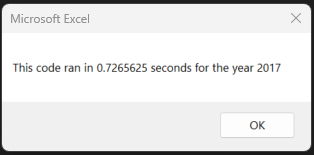
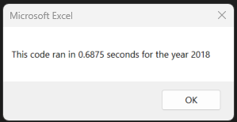
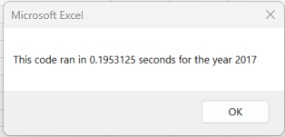
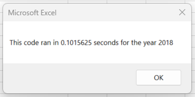

# Green Stock Analysis
## Overview of Project
Steve's parents want to invest their money into DAQO New Energy Corporation. Instead of putting all of their money into one company, Steve wants to analyze 12 green energy stock companies based on how actively the stock is traded and its yearly return. He has given me an Excel containing the stock data and I will be using Visual Basic for Applications (VBA) to build a macro to analyze all the data in a click of a button.
### Purpose
The purpose is to use VBA to build a macro that will analyze data for the entire stock market in 2017 and 2018. A macro was created with a SubRoutine, Range and For Loops to analyze all the stock data. After analyzing the stocks, the macro was refactored to run more efficiently in less amount of time.
## Results
The analysis revealed that more stocks were traded and there was a higher rate of yearly return for each company in 2017 than 2018. First, let's take a look at the company Steve's parents wanted to invest all of their money into, DQ. DQ went from a return rate of 199.4% in 2017 to a -62.6% in 2018. Two companies that did exceptionally well in 2018 with a return rate of 81.9% was ENPH and a return rate of 84.0% was RUN. 

 

## Refactoring the Code
When refactoring the code, a new variable (tickerIndex) was created to access the correct index across the new output arrays (tickerVolumes, tickerStartingPrices, and tickerEndingPrices). Then the foor loops were restructured with the new arrays to get a list for Tickers, Daily Volumes, and Return in less amount of time than the original code. 

We went from our original code,

**_ORIGINAL:_** 

    If Cells(j, 1).Value = ticker Then
    
        totalVolume = totalVolume + Cells(j, 8).Value

    End If
    
    If Cells(j - 1, 1).Value <> ticker And Cells(j, 1).Value = ticker Then
        
        startingPrice = Cells(j, 6).Value
    
    End If
    
    If Cells(j + 1, 1).Value <> ticker And Cells(j, 1).Value = ticker Then
    
    endingPrice = Cells(j, 6).Value
    
   
 To the refactored For Loop, 
   
   **_REFACTORED:_**
   
    tickerVolumes(tickerIndex) = tickerVolumes(tickerIndex) + Cells(i, 8).Value
        
        'If  Then
            
            If Cells(i - 1, 1).Value <> tickers(tickerIndex) And Cells(i, 1).Value = tickers(tickerIndex) Then
                tickerStartingPrices(tickerIndex) = Cells(i, 6).Value
          
            End If

        'If  Then
        If Cells(i + 1, 1).Value <> tickers(tickerIndex) And Cells(i, 1).Value = tickers(tickerIndex) Then
            tickerEndingPrices(tickerIndex) = Cells(i, 6).Value
           
            tickerIndex = tickerIndex + 1
   

## Run Times
The following are the run times using the original code:

 

The following are the run times using the refactored code:

## Summary
- Refactoring the code has a major advatange of reducing the time it takes to analyze the data. The disadvantage of refactoring is that syntax error can mess you up if you do not have a full understanding of VBA code. Having a code that already works and trying to reorganize it can be challenging at first but it does pay off at the end.

- The pro is that you already have the code established and you just have to make minor changes to make the code run more effectively. The con is that the original code might not jbe as effective and will have a longer running time. Refactoring our code allowed us to cut 5 to 6 seconds in our run time. This was only analyzing data for 12 companies, if we had a larger data set it might have taken minutes.
